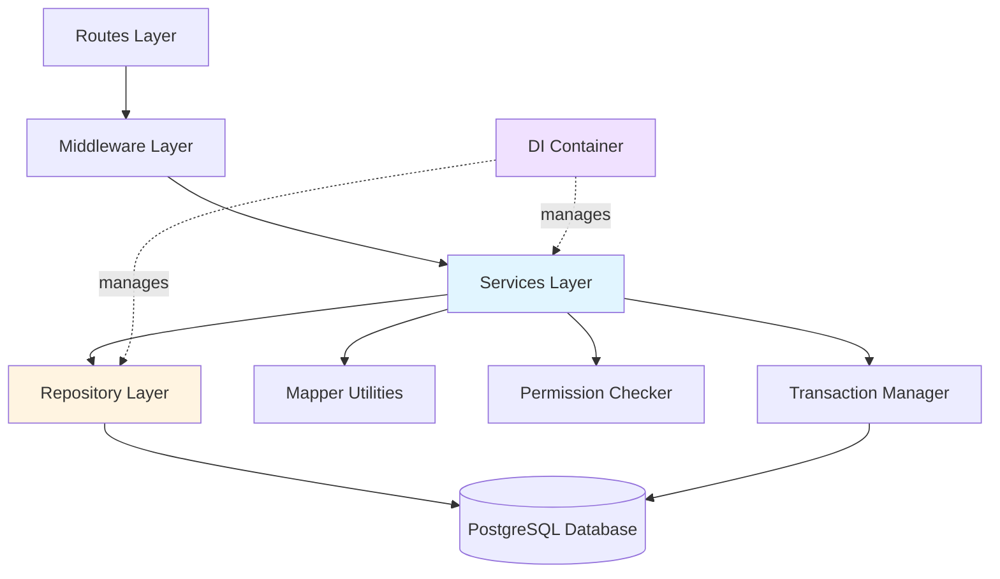

# Design Document: Backend Refactoring

## Overview

This design document outlines the architecture and implementation approach for refactoring the Bounty Hunter Platform backend. The refactoring introduces a Repository layer for data access, centralizes data mapping, implements dependency injection for service decoupling, and creates utilities for permission checking and transaction management.

The refactoring maintains backward compatibility with existing API endpoints while significantly reducing code duplication (targeting 30-40% reduction) and improving testability and maintainability.

### Key Design Principles

1. **Separation of Concerns**: Clear boundaries between data access (Repository), business logic (Service), and presentation (Routes)
2. **Single Responsibility**: Each class has one well-defined purpose
3. **Dependency Inversion**: Services depend on abstractions (interfaces) rather than concrete implementations
4. **Type Safety**: Strict TypeScript typing throughout
5. **Testability**: All components designed for easy unit testing

### Architecture Layers

```
Routes (HTTP handlers)
    ↓
Middleware (Auth, Validation, Error handling)
    ↓
Services (Business logic)
    ↓
Repositories (Data access)
    ↓
Database (PostgreSQL)
```

## Architecture

### Current Architecture Issues

The existing backend has several architectural issues that this refactoring addresses:

1. **Direct Database Access**: Services directly execute SQL queries, mixing business logic with data access
2. **Code Duplication**: User queries repeated 15+ times, task queries 10+ times, data mapping 8+ times
3. **Tight Coupling**: Services have direct dependencies on each other, making testing difficult
4. **Inconsistent Permission Checking**: Permission logic scattered across services
5. **Manual Transaction Management**: Transaction handling duplicated in multiple places

### Target Architecture


The refactored architecture introduces clear separation of concerns:



### Component Responsibilities

**Repository Layer**:
- Encapsulates all database queries
- Uses QueryBuilder for SQL construction
- Returns typed model objects
- Handles database connection management

**Service Layer**:
- Implements business logic
- Orchestrates repository calls
- Uses mappers for data transformation
- Validates permissions via Permission_Checker
- Manages transactions via Transaction_Manager

**Mapper Utilities**:
- Transform models to DTOs
- Handle nested object mapping
- Ensure consistent data representation

**DI Container**:
- Manages service lifecycle
- Resolves dependencies automatically
- Enables easy testing with mock injection

## Components and Interfaces

### BaseRepository

The BaseRepository provides common CRUD operations that all specific repositories inherit.


```typescript
interface IRepository<T> {
  findById(id: number): Promise<T | null>;
  findAll(filters?: Record<string, any>): Promise<T[]>;
  create(data: Partial<T>): Promise<T>;
  update(id: number, data: Partial<T>): Promise<T>;
  delete(id: number): Promise<void>;
}

abstract class BaseRepository<T> implements IRepository<T> {
  protected tableName: string;
  protected queryBuilder: QueryBuilder;
  protected validator: Validator;
  
  constructor(tableName: string) {
    this.tableName = tableName;
    this.queryBuilder = new QueryBuilder();
    this.validator = new Validator();
  }
  
  async findById(id: number): Promise<T | null> {
    // Implementation using queryBuilder
  }
  
  async findAll(filters?: Record<string, any>): Promise<T[]> {
    // Implementation using queryBuilder
  }
  
  async create(data: Partial<T>): Promise<T> {
    // Implementation using queryBuilder
  }
  
  async update(id: number, data: Partial<T>): Promise<T> {
    // Implementation using queryBuilder
  }
  
  async delete(id: number): Promise<void> {
    // Implementation using queryBuilder
  }
}
```

### UserRepository

Extends BaseRepository with user-specific queries.

```typescript
interface IUserRepository extends IRepository<User> {
  findByEmail(email: string): Promise<User | null>;
  findByUsername(username: string): Promise<User | null>;
  findWithStats(userId: number): Promise<User & { stats: UserStats }>;
  updateLastLogin(userId: number): Promise<void>;
}

class UserRepository extends BaseRepository<User> implements IUserRepository {
  constructor() {
    super('users');
  }
  
  async findByEmail(email: string): Promise<User | null> {
    // Custom query for email lookup
  }
  
  async findByUsername(username: string): Promise<User | null> {
    // Custom query for username lookup
  }
  
  async findWithStats(userId: number): Promise<User & { stats: UserStats }> {
    // Join query for user with statistics
  }
  
  async updateLastLogin(userId: number): Promise<void> {
    // Update last login timestamp
  }
}
```

### TaskRepository

Extends BaseRepository with task-specific queries.


```typescript
interface ITaskRepository extends IRepository<Task> {
  findByCreator(creatorId: number): Promise<Task[]>;
  findByGroup(groupId: number): Promise<Task[]>;
  findWithPositions(taskId: number): Promise<Task & { positions: Position[] }>;
  findPublicTasks(filters?: TaskFilters): Promise<Task[]>;
  updateStatus(taskId: number, status: TaskStatus): Promise<Task>;
}

class TaskRepository extends BaseRepository<Task> implements ITaskRepository {
  constructor() {
    super('tasks');
  }
  
  async findByCreator(creatorId: number): Promise<Task[]> {
    // Query tasks by creator
  }
  
  async findByGroup(groupId: number): Promise<Task[]> {
    // Query tasks by group
  }
  
  async findWithPositions(taskId: number): Promise<Task & { positions: Position[] }> {
    // Join query for task with positions
  }
  
  async findPublicTasks(filters?: TaskFilters): Promise<Task[]> {
    // Query public tasks with filtering
  }
  
  async updateStatus(taskId: number, status: TaskStatus): Promise<Task> {
    // Update task status
  }
}
```

### GroupRepository

Extends BaseRepository with group-specific queries.

```typescript
interface IGroupRepository extends IRepository<ProjectGroup> {
  findByOwner(ownerId: number): Promise<ProjectGroup[]>;
  findByMember(userId: number): Promise<ProjectGroup[]>;
  findWithMembers(groupId: number): Promise<ProjectGroup & { members: User[] }>;
  addMember(groupId: number, userId: number, role: string): Promise<void>;
  removeMember(groupId: number, userId: number): Promise<void>;
}

class GroupRepository extends BaseRepository<ProjectGroup> implements IGroupRepository {
  constructor() {
    super('project_groups');
  }
  
  async findByOwner(ownerId: number): Promise<ProjectGroup[]> {
    // Query groups by owner
  }
  
  async findByMember(userId: number): Promise<ProjectGroup[]> {
    // Query groups where user is member
  }
  
  async findWithMembers(groupId: number): Promise<ProjectGroup & { members: User[] }> {
    // Join query for group with members
  }
  
  async addMember(groupId: number, userId: number, role: string): Promise<void> {
    // Add member to group
  }
  
  async removeMember(groupId: number, userId: number): Promise<void> {
    // Remove member from group
  }
}
```

### PositionRepository

Extends BaseRepository with position-specific queries.


```typescript
interface IPositionRepository extends IRepository<Position> {
  findByTask(taskId: number): Promise<Position[]>;
  findByUser(userId: number): Promise<Position[]>;
  findWithApplications(positionId: number): Promise<Position & { applications: Application[] }>;
  updateRanking(positionId: number, ranking: number): Promise<Position>;
}

class PositionRepository extends BaseRepository<Position> implements IPositionRepository {
  constructor() {
    super('positions');
  }
  
  async findByTask(taskId: number): Promise<Position[]> {
    // Query positions by task
  }
  
  async findByUser(userId: number): Promise<Position[]> {
    // Query positions by assigned user
  }
  
  async findWithApplications(positionId: number): Promise<Position & { applications: Application[] }> {
    // Join query for position with applications
  }
  
  async updateRanking(positionId: number, ranking: number): Promise<Position> {
    // Update position ranking
  }
}
```

### Mapper Classes

Mappers transform database models to DTOs for API responses.

```typescript
class TaskMapper {
  static toDTO(task: Task): TaskDTO {
    return {
      id: task.id,
      title: task.title,
      description: task.description,
      status: task.status,
      bounty: task.bounty,
      createdAt: task.created_at,
      updatedAt: task.updated_at,
      creator: task.creator ? UserMapper.toDTO(task.creator) : undefined,
      group: task.group ? GroupMapper.toDTO(task.group) : undefined,
      positions: task.positions ? task.positions.map(p => PositionMapper.toDTO(p)) : undefined
    };
  }
  
  static toDTOList(tasks: Task[]): TaskDTO[] {
    return tasks.map(task => this.toDTO(task));
  }
}

class GroupMapper {
  static toDTO(group: ProjectGroup): GroupDTO {
    return {
      id: group.id,
      name: group.name,
      description: group.description,
      createdAt: group.created_at,
      owner: group.owner ? UserMapper.toDTO(group.owner) : undefined,
      members: group.members ? group.members.map(m => UserMapper.toDTO(m)) : undefined
    };
  }
  
  static toDTOList(groups: ProjectGroup[]): GroupDTO[] {
    return groups.map(group => this.toDTO(group));
  }
}

class PositionMapper {
  static toDTO(position: Position): PositionDTO {
    return {
      id: position.id,
      title: position.title,
      description: position.description,
      bounty: position.bounty,
      ranking: position.ranking,
      status: position.status,
      taskId: position.task_id,
      assignedUser: position.assigned_user ? UserMapper.toDTO(position.assigned_user) : undefined
    };
  }
  
  static toDTOList(positions: Position[]): PositionDTO[] {
    return positions.map(position => this.toDTO(position));
  }
}
```

### Dependency Injection Container


The DI Container manages service dependencies and lifecycle.

```typescript
type ServiceFactory<T> = (container: DIContainer) => T;

class DIContainer {
  private services: Map<string, any> = new Map();
  private factories: Map<string, ServiceFactory<any>> = new Map();
  private resolving: Set<string> = new Set();
  
  register<T>(name: string, factory: ServiceFactory<T>): void {
    if (this.factories.has(name)) {
      throw new Error(`Service ${name} is already registered`);
    }
    this.factories.set(name, factory);
  }
  
  resolve<T>(name: string): T {
    // Check if already instantiated (singleton)
    if (this.services.has(name)) {
      return this.services.get(name);
    }
    
    // Check for circular dependencies
    if (this.resolving.has(name)) {
      throw new Error(`Circular dependency detected: ${name}`);
    }
    
    // Get factory
    const factory = this.factories.get(name);
    if (!factory) {
      throw new Error(`Service ${name} is not registered`);
    }
    
    // Resolve dependencies
    this.resolving.add(name);
    try {
      const instance = factory(this);
      this.services.set(name, instance);
      return instance;
    } finally {
      this.resolving.delete(name);
    }
  }
  
  clear(): void {
    this.services.clear();
    this.resolving.clear();
  }
}

// Usage example
const container = new DIContainer();

container.register('userRepository', () => new UserRepository());
container.register('taskRepository', () => new TaskRepository());
container.register('userService', (c) => new UserService(
  c.resolve('userRepository'),
  c.resolve('permissionChecker')
));
```

### Permission Checker

Centralizes permission validation logic.

```typescript
class PermissionChecker {
  constructor(
    private userRepository: IUserRepository,
    private taskRepository: ITaskRepository,
    private groupRepository: IGroupRepository
  ) {}
  
  async canAccessTask(userId: number, taskId: number): Promise<boolean> {
    const user = await this.userRepository.findById(userId);
    if (!user) return false;
    if (user.role === 'admin') return true;
    
    const task = await this.taskRepository.findById(taskId);
    if (!task) return false;
    
    return task.creator_id === userId;
  }
  
  async canModifyTask(userId: number, taskId: number): Promise<void> {
    const canAccess = await this.canAccessTask(userId, taskId);
    if (!canAccess) {
      throw new UnauthorizedError('You do not have permission to modify this task');
    }
  }
  
  async canAccessGroup(userId: number, groupId: number): Promise<boolean> {
    const user = await this.userRepository.findById(userId);
    if (!user) return false;
    if (user.role === 'admin') return true;
    
    const group = await this.groupRepository.findById(groupId);
    if (!group) return false;
    if (group.owner_id === userId) return true;
    
    const userGroups = await this.groupRepository.findByMember(userId);
    return userGroups.some(g => g.id === groupId);
  }
  
  async canModifyGroup(userId: number, groupId: number): Promise<void> {
    const user = await this.userRepository.findById(userId);
    if (!user) {
      throw new UnauthorizedError('User not found');
    }
    
    if (user.role === 'admin') return;
    
    const group = await this.groupRepository.findById(groupId);
    if (!group) {
      throw new NotFoundError('Group not found');
    }
    
    if (group.owner_id !== userId) {
      throw new UnauthorizedError('You do not have permission to modify this group');
    }
  }
  
  async canAccessPosition(userId: number, positionId: number): Promise<boolean> {
    const user = await this.userRepository.findById(userId);
    if (!user) return false;
    if (user.role === 'admin') return true;
    
    const position = await this.positionRepository.findById(positionId);
    if (!position) return false;
    
    // Check if user owns the task
    return this.canAccessTask(userId, position.task_id);
  }
}
```

### Transaction Manager


Manages database transactions for multi-step operations.

```typescript
import { Pool, PoolClient } from 'pg';

class TransactionManager {
  constructor(private pool: Pool) {}
  
  async executeInTransaction<T>(
    callback: (client: PoolClient) => Promise<T>
  ): Promise<T> {
    const client = await this.pool.connect();
    
    try {
      await client.query('BEGIN');
      const result = await callback(client);
      await client.query('COMMIT');
      return result;
    } catch (error) {
      await client.query('ROLLBACK');
      throw error;
    } finally {
      client.release();
    }
  }
  
  async executeInTransactionWithRetry<T>(
    callback: (client: PoolClient) => Promise<T>,
    maxRetries: number = 3
  ): Promise<T> {
    let lastError: Error | null = null;
    
    for (let attempt = 0; attempt < maxRetries; attempt++) {
      try {
        return await this.executeInTransaction(callback);
      } catch (error) {
        lastError = error as Error;
        if (attempt < maxRetries - 1) {
          await this.delay(Math.pow(2, attempt) * 100);
        }
      }
    }
    
    throw lastError;
  }
  
  private delay(ms: number): Promise<void> {
    return new Promise(resolve => setTimeout(resolve, ms));
  }
}

// Usage example
const txManager = new TransactionManager(pool);

await txManager.executeInTransaction(async (client) => {
  // Create task
  const task = await taskRepository.create(taskData, client);
  
  // Create positions
  for (const positionData of positions) {
    await positionRepository.create({ ...positionData, task_id: task.id }, client);
  }
  
  return task;
});
```

## Data Models

### Core Models

The refactoring maintains existing model interfaces but ensures they are used consistently:

```typescript
interface User {
  id: number;
  username: string;
  email: string;
  password_hash: string;
  role: 'user' | 'admin';
  avatar_url?: string;
  created_at: Date;
  updated_at: Date;
}

interface Task {
  id: number;
  title: string;
  description: string;
  status: 'open' | 'in_progress' | 'completed' | 'cancelled';
  bounty: number;
  creator_id: number;
  group_id?: number;
  created_at: Date;
  updated_at: Date;
  
  // Relations (populated by joins)
  creator?: User;
  group?: ProjectGroup;
  positions?: Position[];
}

interface ProjectGroup {
  id: number;
  name: string;
  description?: string;
  owner_id: number;
  created_at: Date;
  updated_at: Date;
  
  // Relations
  owner?: User;
  members?: User[];
}

interface Position {
  id: number;
  task_id: number;
  title: string;
  description?: string;
  bounty: number;
  ranking: number;
  status: 'open' | 'filled' | 'completed';
  assigned_user_id?: number;
  created_at: Date;
  updated_at: Date;
  
  // Relations
  task?: Task;
  assigned_user?: User;
}
```

### DTO Models

DTOs for API responses with camelCase naming:


```typescript
interface UserDTO {
  id: number;
  username: string;
  email: string;
  role: string;
  avatarUrl?: string;
  createdAt: string;
  updatedAt: string;
}

interface TaskDTO {
  id: number;
  title: string;
  description: string;
  status: string;
  bounty: number;
  createdAt: string;
  updatedAt: string;
  creator?: UserDTO;
  group?: GroupDTO;
  positions?: PositionDTO[];
}

interface GroupDTO {
  id: number;
  name: string;
  description?: string;
  createdAt: string;
  owner?: UserDTO;
  members?: UserDTO[];
}

interface PositionDTO {
  id: number;
  title: string;
  description?: string;
  bounty: number;
  ranking: number;
  status: string;
  taskId: number;
  assignedUser?: UserDTO;
}
```

## Refactored Service Examples

### UserService (Refactored)

```typescript
class UserService {
  constructor(
    private userRepository: IUserRepository,
    private permissionChecker: PermissionChecker
  ) {}
  
  async getUserById(userId: number): Promise<UserDTO> {
    const user = await this.userRepository.findById(userId);
    if (!user) {
      throw new NotFoundError('User not found');
    }
    return UserMapper.toDTO(user);
  }
  
  async getUserWithStats(userId: number): Promise<UserDTO & { stats: any }> {
    const user = await this.userRepository.findWithStats(userId);
    if (!user) {
      throw new NotFoundError('User not found');
    }
    return {
      ...UserMapper.toDTO(user),
      stats: user.stats
    };
  }
  
  async updateUser(requesterId: number, userId: number, data: Partial<User>): Promise<UserDTO> {
    // Permission check
    if (requesterId !== userId) {
      const requester = await this.userRepository.findById(requesterId);
      if (!requester || requester.role !== 'admin') {
        throw new UnauthorizedError('You do not have permission to update this user');
      }
    }
    
    const updated = await this.userRepository.update(userId, data);
    return UserMapper.toDTO(updated);
  }
}
```

### TaskService (Refactored)

```typescript
class TaskService {
  constructor(
    private taskRepository: ITaskRepository,
    private positionRepository: IPositionRepository,
    private permissionChecker: PermissionChecker,
    private transactionManager: TransactionManager
  ) {}
  
  async getTaskById(taskId: number): Promise<TaskDTO> {
    const task = await this.taskRepository.findWithPositions(taskId);
    if (!task) {
      throw new NotFoundError('Task not found');
    }
    return TaskMapper.toDTO(task);
  }
  
  async createTask(userId: number, data: CreateTaskInput): Promise<TaskDTO> {
    return this.transactionManager.executeInTransaction(async (client) => {
      // Create task
      const task = await this.taskRepository.create({
        ...data,
        creator_id: userId,
        status: 'open'
      }, client);
      
      // Create positions if provided
      if (data.positions && data.positions.length > 0) {
        for (const posData of data.positions) {
          await this.positionRepository.create({
            ...posData,
            task_id: task.id,
            status: 'open'
          }, client);
        }
      }
      
      // Fetch complete task with positions
      const completeTask = await this.taskRepository.findWithPositions(task.id);
      return TaskMapper.toDTO(completeTask);
    });
  }
  
  async updateTask(userId: number, taskId: number, data: Partial<Task>): Promise<TaskDTO> {
    await this.permissionChecker.canModifyTask(userId, taskId);
    
    const updated = await this.taskRepository.update(taskId, data);
    return TaskMapper.toDTO(updated);
  }
  
  async deleteTask(userId: number, taskId: number): Promise<void> {
    await this.permissionChecker.canModifyTask(userId, taskId);
    await this.taskRepository.delete(taskId);
  }
}
```

Now I need to use the prework tool to analyze acceptance criteria before writing the Correctness Properties section.


## Correctness Properties

A property is a characteristic or behavior that should hold true across all valid executions of a system—essentially, a formal statement about what the system should do. Properties serve as the bridge between human-readable specifications and machine-verifiable correctness guarantees.

### Property 1: Mapper Consistency

*For any* valid model object (Task, ProjectGroup, or Position), mapping it to a DTO should produce an object with all required fields populated and correct type conversions applied (snake_case to camelCase, Date to string).

**Validates: Requirements 2.1, 2.2, 2.3, 2.4, 2.5**

### Property 2: DI Container Singleton Behavior

*For any* registered service, resolving it multiple times from the DI Container should return the exact same instance (referential equality).

**Validates: Requirements 3.2, 3.4**

### Property 3: DI Container Dependency Resolution

*For any* service with dependencies, when resolved from the DI Container, all of its dependencies should be automatically resolved and injected before the service is instantiated.

**Validates: Requirements 3.3**

### Property 4: Permission Validation

*For any* user and resource (task, group, or position), the Permission_Checker should grant access if and only if the user is an admin OR the user owns/is a member of the resource.

**Validates: Requirements 4.1, 4.2, 4.3**

### Property 5: Permission Error Handling

*For any* unauthorized access attempt, the Permission_Checker should throw an UnauthorizedError with a descriptive message that includes the resource type and action attempted.

**Validates: Requirements 4.4, 4.7**

### Property 6: Transaction Commit on Success

*For any* sequence of database operations executed within a transaction, if all operations succeed, then all changes should be committed and visible to subsequent queries.

**Validates: Requirements 5.2**

### Property 7: Transaction Rollback on Failure

*For any* sequence of database operations executed within a transaction, if any operation fails, then all changes should be rolled back and the database should remain in its original state.

**Validates: Requirements 5.3**

### Property 8: Transaction Connection Release

*For any* transaction (whether successful or failed), the database connection should be released back to the pool after the transaction completes.

**Validates: Requirements 5.6, 9.3, 9.5**

### Property 9: Transaction Error Propagation

*For any* error that occurs within a transaction, the error should be propagated to the caller after rollback, preserving the original error type and stack trace.

**Validates: Requirements 5.7, 8.8**

### Property 10: API Backward Compatibility

*For any* existing API endpoint, after refactoring, the response structure and status codes should remain identical to the pre-refactoring behavior for the same inputs.

**Validates: Requirements 6.7**

### Property 11: Error Type Consistency

*For any* error condition (validation failure, authorization failure, resource not found), the system should throw the appropriate error type (ValidationError, UnauthorizedError, NotFoundError) with a descriptive message.

**Validates: Requirements 8.4, 8.5, 8.6**

### Property 12: Connection Error Handling

*For any* database connection error, the Repository should handle it gracefully by throwing a descriptive error without crashing the application or leaking connections.

**Validates: Requirements 9.7**

## Error Handling

### Error Hierarchy

The refactoring maintains the existing error hierarchy:

```typescript
class AppError extends Error {
  constructor(
    public message: string,
    public statusCode: number,
    public isOperational: boolean = true
  ) {
    super(message);
    Object.setPrototypeOf(this, AppError.prototype);
    Error.captureStackTrace(this, this.constructor);
  }
}

class ValidationError extends AppError {
  constructor(message: string) {
    super(message, 400);
  }
}

class UnauthorizedError extends AppError {
  constructor(message: string) {
    super(message, 403);
  }
}

class NotFoundError extends AppError {
  constructor(message: string) {
    super(message, 404);
  }
}

class DatabaseError extends AppError {
  constructor(message: string) {
    super(message, 500);
  }
}
```

### Error Handling Patterns

**Repository Layer**:
- Catch database errors and wrap in DatabaseError
- Preserve original error message and stack trace
- Release connections in finally blocks

**Service Layer**:
- Validate inputs and throw ValidationError
- Check permissions and throw UnauthorizedError
- Check resource existence and throw NotFoundError
- Let database errors propagate

**Transaction Manager**:
- Catch all errors during transaction
- Rollback on any error
- Release connection in finally block
- Re-throw original error

## Testing Strategy

### Dual Testing Approach

The refactoring requires both unit tests and property-based tests for comprehensive coverage:

**Unit Tests**:
- Specific examples demonstrating correct behavior
- Edge cases (null values, empty arrays, boundary conditions)
- Error conditions (invalid inputs, missing resources, unauthorized access)
- Integration between components

**Property-Based Tests**:
- Universal properties that hold for all inputs
- Randomized input generation for comprehensive coverage
- Minimum 100 iterations per property test
- Each test tagged with feature name and property number

### Testing Framework

**Framework**: Vitest
**Property-Based Testing Library**: fast-check (TypeScript/JavaScript)

### Property Test Configuration

Each property test should:
1. Run minimum 100 iterations
2. Include a comment tag: `// Feature: backend-refactoring, Property N: [property text]`
3. Reference the design document property number
4. Use fast-check generators for input randomization

Example property test structure:

```typescript
import { describe, it, expect } from 'vitest';
import fc from 'fast-check';

describe('Mapper Consistency', () => {
  // Feature: backend-refactoring, Property 1: Mapper Consistency
  it('should consistently map model objects to DTOs', () => {
    fc.assert(
      fc.property(
        fc.record({
          id: fc.integer({ min: 1 }),
          title: fc.string(),
          created_at: fc.date(),
          // ... other fields
        }),
        (task) => {
          const dto = TaskMapper.toDTO(task);
          expect(dto.id).toBe(task.id);
          expect(dto.title).toBe(task.title);
          expect(dto.createdAt).toBe(task.created_at.toISOString());
          // ... other assertions
        }
      ),
      { numRuns: 100 }
    );
  });
});
```

### Test Coverage Goals

- Repository classes: 90%+ coverage
- Mapper classes: 95%+ coverage
- DI Container: 90%+ coverage
- Permission Checker: 90%+ coverage
- Transaction Manager: 85%+ coverage
- Refactored services: 80%+ coverage

### Integration Testing

Integration tests should verify:
- Services work correctly with real repositories
- Transactions commit and rollback properly
- Permission checks integrate with services
- API endpoints return correct responses
- Database connections are managed properly

## Implementation Notes

### Migration Strategy

The refactoring should be implemented incrementally:

1. **Phase 1**: Create infrastructure (Repository, Mapper, DI Container, utilities)
2. **Phase 2**: Refactor one service (UserService) as a proof of concept
3. **Phase 3**: Refactor remaining services (TaskService, GroupService, etc.)
4. **Phase 4**: Update tests and documentation

### Backward Compatibility

To maintain backward compatibility:
- Keep existing API endpoint signatures unchanged
- Maintain response format (DTO structure)
- Preserve error status codes
- Keep existing middleware unchanged

### Performance Considerations

- Connection pooling prevents connection overhead
- Repository caching can be added later if needed
- Transaction batching reduces round trips
- Mapper performance is negligible (simple transformations)

### Future Enhancements

After initial refactoring:
- Add repository caching layer
- Implement query result pagination
- Add database query logging
- Create repository interfaces for easier mocking
- Add performance monitoring
